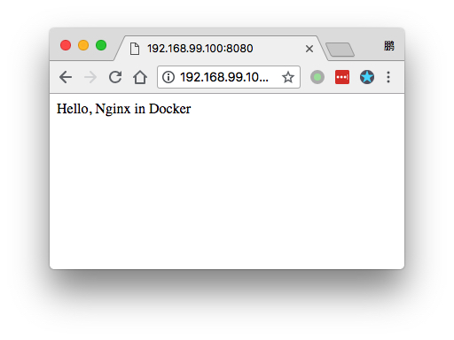

Docker Nginx Map Port and Dir Demo
==================================

使用docker nginx来为本机的文件提供网站服务.

```
docker run --name my-nginx -v /some/content:/usr/share/nginx/html:ro -p 8080:80 -d nginx
```

其中:

- `--name my-nginx`：给这个container指定名字为`my-nginx`，方便查看
- `-v /some/content:/usr/share/nginx/html:ro`: 把本机的`/some/content`映射到docker container中的`/usr/share/nginx/html`目录（就是nginx需要的），`ro`表示readonly
- `-p 8080:80`：表示把本机的`8080`端口映射到container中的`80`，这样我们访问本机`80`端口即可
- `-d`: detach，表示在后台执行，将会打印出container id
- `nginx`: 表示要执行的image名字为`nginx`，由于没有指明版本，所以会取`nginx:latest`

使用local-site目录
--------------

我们已经准备好了`local-site`目录，下面我们将把它映射给nginx container。

由于`-v`参数中只能使用绝对路径，所以我们需要通过拿到`./local-site`的绝对路径：

Fish下是：

```
(pwd)/local-site
```

Bash下是：

```
`pwd`/local-site
```

在Fish下：

```
docker run --name my-nginx -v (pwd)/local-site:/usr/share/nginx/html:ro -p 8080:80 -d nginx
```

如果是在Ubuntu下，打开<http://localhost:8080>就能看到页面上写着`Hello, Nginx in Docker`

如果是Mac，需要使用`docker-machine ip`命令拿到当前docker machine的ip后访问：



注意
---

关于`-v`，这里有一个很神奇的地方需要注意。

`-v`是将宿主机上的某个目录或者文件，映射到docker container中。
在Ubuntu下，这没有什么特别的；
但是在Mac下，docker container并不是运行于Mac主机，而是一个docker machine的中间层Linux虚拟机上，
而我们的参数`-v /some/content:/usr/share/nginx/html`，实际上是把Mac主机上的某个目录，越过真正的宿主机（中间层Linux），映射到了docker container上。
看来是Mac下的docker做了特别处理。

同时需要注意的是，对于端口映射`-p`，Mac上在docker似乎没有做特别处理，它只是把中间层Linux的端口与运行在其中的docker container的端口做了映射，而没有处理Mac主机，所以我们必须访问中间层Linux的ip和端口，才能得到正确回复。

